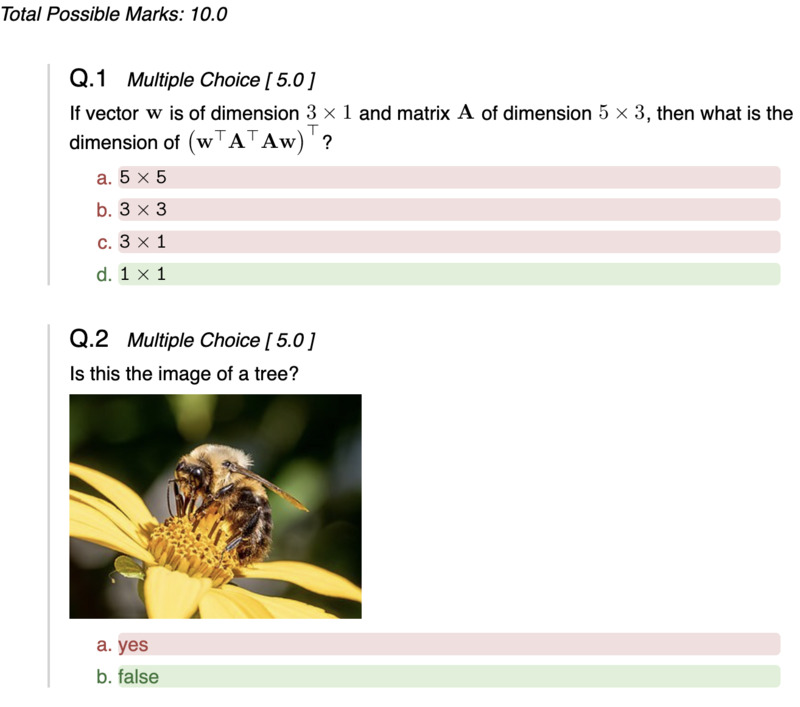
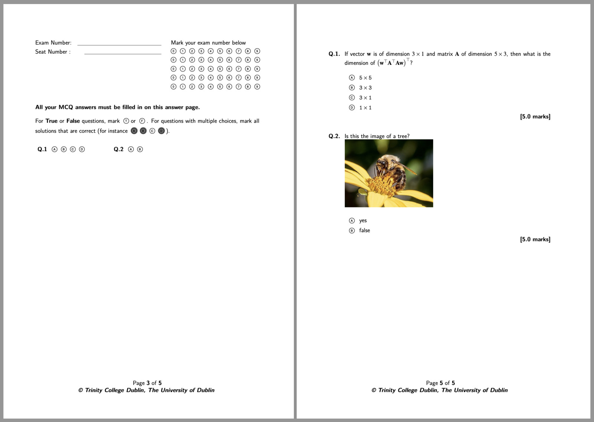

# BBQuiz

Tool for converting a list of questions in yaml/markdown to a BlackBoard test or
to a Latex exam source file

Here is a minimal example of a `quiz.yaml` file. You write the questions in a YAML
file, using a Markdown syntax:

```yaml
- type: mc
  marks: 5           
  question: |
    If vector ${\bf w}$ is of dimension $3 \times 1$ and matrix ${\bf A}$ of
    dimension $5 \times 3$, then what is the dimension of $\left({\bf w}^{\top}{\bf
    A}^{\top}{\bf A}{\bf w}\right)^{\top}$?

  answers:
    - answer:  ${\tt 5}\times {\tt 5}$
      correct: false
    - answer:  ${\tt 3}\times {\tt 3}$
      correct: false
    - answer:  ${\tt 3}\times {\tt 1}$
      correct: false
    - answer:  ${\tt 1}\times {\tt 1}$
      correct: true

- type: mc
  marks: 5         
  question: |
    Is this the image of a tree?
    
    { width=30em }
    
  answers:
    - answer: "yes"
      correct: false
    - answer: "false"
      correct: true
```

Then you can generate the BlackBoard exam, LaTeX, and HTML preview using the
following command in the terminal:

```
bbquiz quiz.yaml
```

and this is what the provided default HTML preview looks like:



and this is what the BlackBoard output would look like:


and this is what the provided LaTeX template pdf output would look like:




# Getting Started

```bash
pip install .
```

You will also need a LaTeX installation with `gs` and `pdflatex`. 


# Usage


```
Usage: bbquiz [-h] [-w] [--config CONFIGFILE] [--build] [--diff] [--zsh] [--fish] [-v] [--debug] [--verbose]
              [quiz.yaml] [otherfiles [otherfiles ...]]

Converts a questions in a YAML/markdown format into a Blackboard test or a LaTeX script

Positional Arguments:
  quiz.yaml            path to the quiz in a yaml format
  otherfiles           other yaml files

Optional Arguments:
  -h, --help           show this help message and exit
  -w, --watch          continuously compiles the document on file change
  --config CONFIGFILE  user config file. Default location is /Users/fpitie/Library/Application Support/bbquiz
  --build              compiles all targets and run all post-compilation commands
  --diff               compares questions from first yaml file to rest of files
  --zsh                A helper command used for exporting the command completion code in zsh
  --fish               A helper command used for exporting the command completion code in fish
  -v, --version        show program's version number and exit
  --debug              Print lots of debugging statements
  --verbose            set verbose on
```

For instance, running BBQuiz on the simple example gives us:

```
$ bbquiz quiz1.yaml

..  pdflatex compilation

  Q  Type  Marks  #    Exp  Question Statement
 ────────────────────────────────────────────────────────────────────────
  1   mc     5.0  4    1.2  If vector ${\bf w}$ is of dimension $3
                            \times 1$ and matrix ${\bf A}$ of […]
  2   mc     5.0  2    2.5  Is this the image of a tree? […]
 ────────────────────────────────────────────────────────────────────────
  2   --    10.0  -  37.5%

╭──────────────────────────── Target Ouputs ─────────────────────────────╮
│                                                                        │
│   BlackBoard CSV   quiz1.txt                                           │
│   html preview     quiz1.html                                          │
│   latex            latexmk -xelatex -pvc quiz1.tex                     │
│   Latex solutions  latexmk -xelatex -pvc quiz1.solutions.tex           │
│                                                                        │
╰────────────────────────────────────────────────────────────────────────╯
```

The command returns a table that summarises some statistics about this
exam. Namely, it lists all the questions, their types, their marks, the number
of possible options per question, the expected mark if it is answered randomly.

The rendered target outputs are shown at the end. It will also indicate how to
further compile the output if it is required. For instance, to compile the
genereated LaTeX into a pdf, you can do it with 

```
latexmk -xelatex -pvc quiz1.tex
```

This can be done automatically by asking BBQuiz to also build the output
targets:

```
$ bbquiz --build quiz1.yaml
```

When working on a test, you can also use the `-w` flag to continuously watch for
any file change and recompile the target on changes:

```
$ bbquiz -w quiz1.yaml
```


# BBYaml Syntax

BBQuiz takes in a YAML file. [YAML](https://en.wikipedia.org/wiki/YAML) is a
generic human-readable data-serialization language, typically used for
configuration files, and it is used here to define the questions' statements,
marks, type, answers, etc.

One motivation behind using YAML is that all text entries (e.g., question
statements, answers, etc.) can be written in
[Markdown](https://en.wikipedia.org/wiki/Markdown). With a few extensions, you
can also use LaTeX equations and tables too.

Below is an longer example of what an exam script would look like:

```yaml

- type: header
  author: François Pitié
  date: Semester 2 - 2020/2021
  title: EEU44C08/EE5M08 Exam
  examtime: 14:00--16:00
  examdate: 23/04/2021
  examyear: 2021
  examvenue: online
  examsemester: Semester 2
  programmeyear: Senior Sophister
  modulename: Image and Video Processing
  modulecode: EEU44C08-1 
  examiner: Dr. F. Pitié
  instructions: "" 
  materials: ""
  additionalinformation: ""
  pre_latexpreamble: |
    \newcommand{\R}{\mathbb{R}}

- type: mc
  marks: 5           
  question: |
    If vector ${\bf w}$ is of dimension $3 \times 1$ and matrix ${\bf A}$ of
    dimension $5 \times 3$, then what is the dimension of $\left({\bf w}^{\top}{\bf
    A}^{\top}{\bf A}{\bf w}\right)^{\top}$?

  answers:
    - answer:  ${\tt 5}\times {\tt 5}$
      correct: false
    - answer:  ${\tt 3}\times {\tt 3}$
      correct: false
    - answer:  ${\tt 3}\times {\tt 1}$
      correct: false
    - answer:  ${\tt 1}\times {\tt 1}$
      correct: true
    - answer:  ${\tt 1}\times {\tt 5}$
      correct: false
    - answer:  ${\tt 1}\times {\tt 3}$
      correct: false

- type: ma
  marks: 5         
  question: |
    Consider the binary class dataset below (with 2 features $(x_1, x_2)\in\R^2$
    and 2 classes (cross and circle). Select all suitable classification
    techniques for this dataset.

    { width=30em }
    
  answers:
    - answer: Decision Tree
      correct: true
    - answer: Logistic Regression
      correct: true
    - answer: Random Forest
      correct: true
    - answer: Least Squares
      correct: false

- type: matching
  marks: 2.5
  question: |
    Match the images to their corresponding PSD (the DC component is at the
    center of the PSD image).

    Explain your choices.     
  answers:
    - answer: |
        {width=30em}
      correct: |
        {width=30em}
    - answer: |
        {width=30em}
      correct: |
        {width=30em}
    - answer: |
        {width=30em}
      correct: |
        {width=30em}
    - answer: |
        {width=30em}
      correct: |
        {width=30em}

- type: essay
  marks: 10
  question: |
    Prove, in no more than a page, that the Riemann zeta function has its zeros
    only at the negative even integers and complex numbers with real part
    $\frac{1}{2}$.
  answer: |
    See handouts for a detailed answer.
        
```


## Question Types Syntax

BBQuiz currently supports 5 types of questions.

### Essay

The student is expected to write down a few sentences. The `answer` field
provides an indicative answer that can be used as guideline for marking.

```yaml
- type: essay
  marks: 14
  question: |
    my question statement in Mardown
  answer: |
    a suggestion for how to answer that essay question   
```

### Multiple Choice

In multiple choice questions, only one answer/statement is correct.

```yaml
- type: mc
  marks: 4
  question: |
    question statement goes here...
  answers:
    - answer:  text for answer 1
      correct: true
    - answer:  text for answer 2
      correct: false
    - answer:  text for answer 3
      correct: false
    - answer:  text for answer 4
      correct: false
```

### Multiple Answers

This is the same as for multiple choices, except that more than one answer can
be true (potentially zero or all statements can be correct).

```yaml
- type: ma
  marks: 4
  question: |
    question statement goes here...
  answers:
    - answer:  text for answer 1
      correct: true
    - answer:  text for answer 2
      correct: false
    - answer:  text for answer 3
      correct: true
    - answer:  text for answer 4
      correct: false
```
### Matching

In Matching questions, the student is asked to map each statement (`answer`)
with its corresponding match (`correct`). For n statements, there are factorial
n possibilities. The (`answer`,`correct`) statements are shuffled when
generating the exam (see how to set the random seed here).

```yaml
- type: matching
  marks: 5
  question: |
    question statement goes here...
      
  answers:
    - answer: text 1
      correct: text for correct match for text 1
    - answer: text 2
      correct: text for correct match for text 2
    - answer: text 3
      correct: text for correct match for text 3
    - answer: text 4
      correct: text for correct match for text 4 
```

### Ordering

In Ordering questions, the student is asked to rank each statement (`answer`) in
correct order. The statements need to be entered in correct order. Shuffling
occurs when generating the exam (see how to set the random seed here). 

```yaml
- type: ordering
  marks: 5
  question: |
    Order the following trees in **decreasing** order of height.
  
  answers:
    - answer: tree 1
    - answer: tree 2
    - answer: tree 3
```

### Header

An optional header section can be declared at the start of the yaml file.  All
(key, val) pairs declared in this section will be sent to the template
renderer. For instance your LaTeX template might require information about the
exam date, venue, etc. The header must be the first item in the BBYaml file.

```yaml
- type: header
  descr: |
    A very long exam
    
    You are all going to suffer.
  venue: Maxwell Theatre
  date: 13/05/2024
```

Note that it is recommended for the key names should contain only uppercase and
lowercase alphabetical characters: a-z and A-Z, without any numeral or other
non-letter character.  This is because, in the LaTeX template, it is expected
that the keys will be copied accross as follows:

```tex
\def\descr{
    A very long exam
    
    You are all going to suffer.
}
\def\venue{Maxwell Theatre}
\def\date{13/05/2024}
```

Hence each key will be turned into a LaTeX macro.

If you your key starts with the prefix `pre_`, as in `pre_latexpreamble`, the
key should not be turned into a macro by the LaTeX template.

#### Random Generator

__not yet implemented__

You can set a random seed generator by assigning the key `srand` (eg. `srand:
42`) in the header.

#### LaTeX preamble

You can set a LaTeX preamble by assigning the key `pre_latexpreamble` in the
header. The value for this key will not be interpretrated as a raw string and
not as Mardown.

## Markdown Syntax

All yaml entries, including the question statements and answers, will be
interprated as Markdown. 

To avoid the Markdown conversion, a key must be prefixed with `pre_`.

### Markdown Syntax 

Text Tags can be found here:

https://commonmark.org/help/

### Markdown Extensions

We propose a few Markdown extensions. 

__needs to be documented__


# Configuration File and Target Templates

After reading the BBYaml file and converting the markdown entries into LaTeX or
HTML, BBQuiz uses jinja2 templates to render the various targets (BlackBoard
compatible quiz, HTML preview or LaTeX).

## Configuration Files Location

The list of targets can be defined in the configuration file. The default config
file is called `bbquiz.cfg`.

BBQuiz will first try to read this file in 
1. the local directory from which BBQuiz is called 
2. the default application config dir 
3. the install package templates dir

For instance, on my mac, it will be:
1. `./bbquiz.cfg`
2. `~/Library/Application\ Support/bbquiz/bbquiz.cfg`
3. `~/Library/Python/3.9/lib/python/site-packages/bbquiz/templates/bbquiz.cfg`

You can otherwise directly specify the path with the `--config CONFIGFILE` option.

The `--verbose` flag will report which config file is actually being used. This
can be useful for making sure that the correct config file is being edited.


## Defining Your Own Targets

The configuration file defines the list of all the targets. For instance, the
BlackBoard csv quiz file can be defined as the following target:

```yaml
  - out       : ${inputbasename}.txt     # template for outputfilename.
                                         # ${inputbasename} refers to the basename of the quiz
                                         # (eg. mcq-01.yaml => mcq-01)
    descr     : BlackBoard CSV           # description for the target. 
    descr_cmd : ${inputbasename}.txt     # command to use (here we have no suggestion, so just print output path)
    fmt       : html                     # latex or html: format that markdown gets converted to
    html_pre  : html-latex-preamble.tex  # latex preamble for generating the equations in the markdown > html conversion
    html_css  : html-inline-style.css    # CSS used for inline styling the HTML render.
                                         # e.g. it can be used to stye <code></code>, tables, line separation, etc.
    template  : bb.jinja                 # filename for the jinja template used
```

As for the config file directory, any resource file or template file is defined
as a relative path, the template is searched in:
1. the local directory from which BBQuiz is called 
2. the default application config dir 
3. the install package templates dir


## Writing Your Own Rendering Templates

Templates are rendered with Jinja2. The [Jinja2 Template Designer
Documentation](https://jinja.palletsprojects.com/en/3.1.x/templates/) provides
complete information about how to write jinja2 templates.

The default templates used in BBQuiz can be found in the `templates`
directory. (Again, use `--verbose` to know which template is actually being
used)

Note that to be compatible with both LaTeX and HTML, we use the following
delimiters:
* `<| ... |>`  for Statements
* `<< ... >>`  for Expressions
* `<# ... #>`  for Comments

## Setting up your local LaTeX

To be able to compile the LaTeX targets, you will need to have the required
LaTeX assets `.sty` `.cls` and other images.

The best way is to copy these templates in the local TEXMF tree so that LaTeX
can see them. To know where your local tree is, you can run this command in the
terminal:

```bash
kpsewhich -var-value=TEXMFHOME
```

In my case it says that my local TEXMF tree is located at
`~/Library/texmf/`. You can create a dedicated directory for your templates,
e.g., 

```bash
mkdir -p  ~/Library/texmf/tex/latex/bbquiz-templates/
```

I can then copy the required templates to that location:

```bash
unzip bbquiz-latex-templates.zip ~/Library/texmf/tex/latex/bbquiz-templates/
```

and then update LaTeX:
```bash
texhash ~/Library/texmf/tex/latex/bbquiz-templates/
```

At that point you should be able to compile your LaTeX targets from anywhere.


Alternatively,
```bash
set TEXINPUTS=/path/to/package/a/c/b/c/d
```

# Utils

## Diff

The `--diff` flag allows you to check whether some questions can be found in
other tests. For instance:

```bash
bbquiz --diff exam-2024.yaml exam-2023.yaml exam-2022.yaml ...
```

This will list all the questions in `exam-2024.yaml` that can be found in older
exams. Duplicate files will be ignored.

On my setup, I have all yaml files into a single directory (e.g.,
`exam-2023.yaml`, `midterm-2021.yaml`, `tutorial-02.yaml`), so I would call it
like this:

```bash
bbquiz --diff exam-2024.yaml exam-*.yaml midterm-*.yaml tutorial-*.yaml
```


