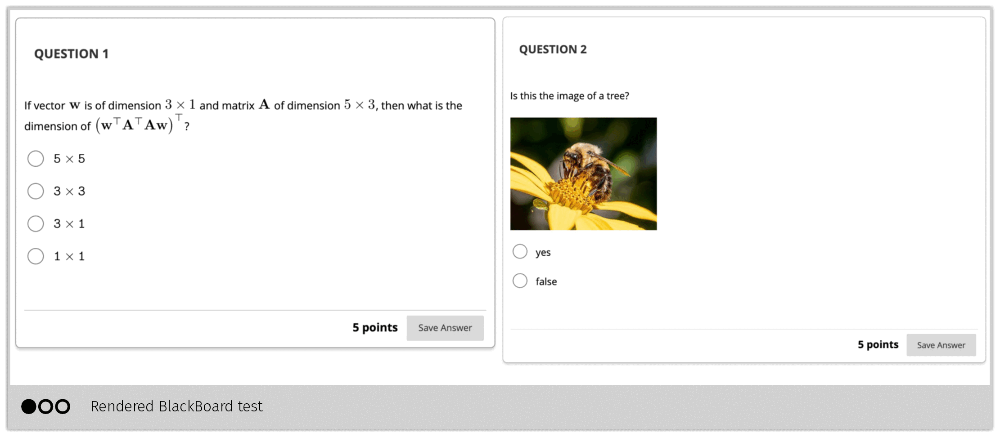

# BBQuiz   <!-- {docsify-ignore} -->

> Tool for converting a list of questions in yaml/markdown to a BlackBoard test or
> to a Latex exam source file

Here is a minimal example of a `quiz.yaml` file. You write the questions in a YAML
file, using a Markdown syntax:

```yaml
- type: mc
  marks: 5           
  question: |
    If vector ${\bf w}$ is of dimension $3 \times 1$ and matrix ${\bf A}$ of
    dimension $5 \times 3$, then what is the dimension of $\left({\bf w}^{\top}{\bf
    A}^{\top}{\bf A}{\bf w}\right)^{\top}$?

  answers:
    - answer:  $5 \times 5$
      correct: false
    - answer:  $3 \times 3$
      correct: false
    - answer:  $3 \times 1$
      correct: false
    - answer:  $1 \times 1$
      correct: true

- type: mc
  marks: 5         
  question: |
    Is this the image of a tree?
    
    { width=30em }
    
  answers:
    - answer: "yes"
      correct: false
    - answer: "false"
      correct: true
```

Then you can generate multiple render targets, including BlackBoard test, LaTeX,
and an HTML preview. 

```shell-session
$ bbquiz quiz1.yaml

..  pdflatex compilation

  Q  Type  Marks  #    Exp  Question Statement
 ────────────────────────────────────────────────────────────────────────
  1   mc     5.0  4    1.2  If vector ${\bf w}$ is of dimension $3
                            \times 1$ and matrix ${\bf A}$ of […]
  2   mc     5.0  2    2.5  Is this the image of a tree? […]
 ────────────────────────────────────────────────────────────────────────
  2   --    10.0  -  37.5%

╭──────────────────────────── Target Ouputs ─────────────────────────────╮
│                                                                        │
│   BlackBoard CSV   quiz1.txt                                           │
│   html preview     quiz1.html                                          │
│   latex            latexmk -xelatex -pvc quiz1.tex                     │
│   Latex solutions  latexmk -xelatex -pvc quiz1.solutions.tex           │
│                                                                        │
╰────────────────────────────────────────────────────────────────────────╯

```

and this is what the rendered outputs look like:




