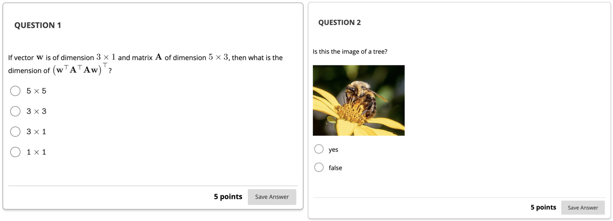

# BBQuiz   <!-- {docsify-ignore} -->

Tool for converting a list of questions in yaml/markdown to a BlackBoard test or
to a Latex exam source file

Here is a minimal example of a `quiz.yaml` file. You write the questions in a YAML
file, using a Markdown syntax:

```yaml
- type: mc
  marks: 5           
  question: |
    If vector ${\bf w}$ is of dimension $3 \times 1$ and matrix ${\bf A}$ of
    dimension $5 \times 3$, then what is the dimension of $\left({\bf w}^{\top}{\bf
    A}^{\top}{\bf A}{\bf w}\right)^{\top}$?

  answers:
    - answer:  ${\tt 5}\times {\tt 5}$
      correct: false
    - answer:  ${\tt 3}\times {\tt 3}$
      correct: false
    - answer:  ${\tt 3}\times {\tt 1}$
      correct: false
    - answer:  ${\tt 1}\times {\tt 1}$
      correct: true

- type: mc
  marks: 5         
  question: |
    Is this the image of a tree?
    
    { width=30em }
    
  answers:
    - answer: "yes"
      correct: false
    - answer: "false"
      correct: true
```

Then you can generate the BlackBoard exam, LaTeX, and HTML preview using the
following command in the terminal:

```
bbquiz quiz.yaml
```

and this is what the provided default HTML preview looks like:


and this is what the BlackBoard output would look like:



and this is what the provided LaTeX template pdf output would look like:


